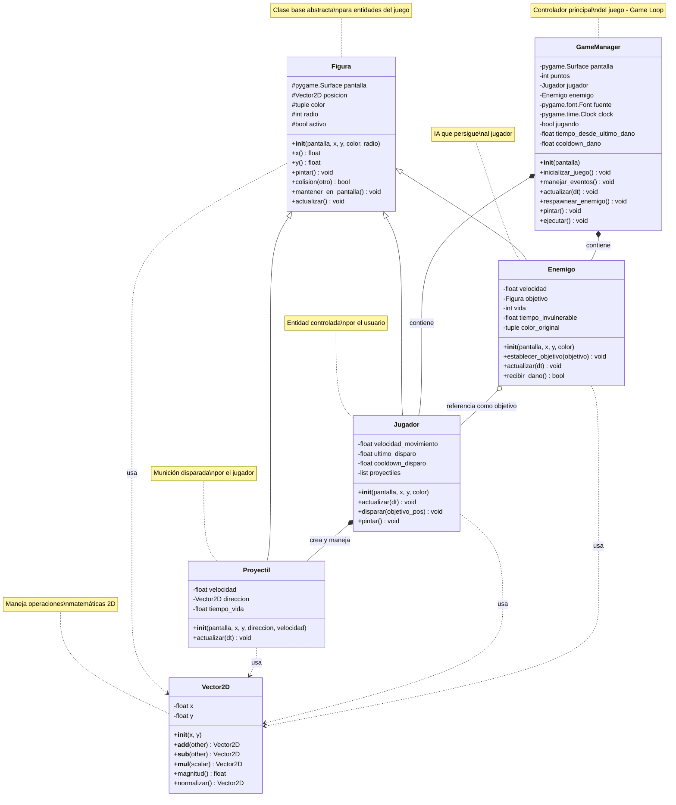

# Diagrama de Clases

```mermaid
classDiagram
    class Vector2D {
        -float x
        -float y
        +__init__(x, y)
        +__add__(other) Vector2D
        +__sub__(other) Vector2D
        +__mul__(scalar) Vector2D
        +magnitud() float
        +normalizar() Vector2D
    }

    class Figura {
        #pygame.Surface pantalla
        #Vector2D posicion
        #tuple color
        #int radio
        #bool activo
        +__init__(pantalla, x, y, color, radio)
        +x() float
        +y() float
        +pintar() void
        +colision(otro) bool
        +mantener_en_pantalla() void
        +actualizar() void
    }

    class Proyectil {
        -float velocidad
        -Vector2D direccion
        -float tiempo_vida
        +__init__(pantalla, x, y, direccion, velocidad)
        +actualizar(dt) void
    }

    class Jugador {
        -float velocidad_movimiento
        -float ultimo_disparo
        -float cooldown_disparo
        -list proyectiles
        +__init__(pantalla, x, y, color)
        +actualizar(dt) void
        +disparar(objetivo_pos) void
        +pintar() void
    }

    class Enemigo {
        -float velocidad
        -Figura objetivo
        -int vida
        -float tiempo_invulnerable
        -tuple color_original
        +__init__(pantalla, x, y, color)
        +establecer_objetivo(objetivo) void
        +actualizar(dt) void
        +recibir_dano() bool
    }

    class GameManager {
        -pygame.Surface pantalla
        -int puntos
        -Jugador jugador
        -Enemigo enemigo
        -pygame.font.Font fuente
        -pygame.time.Clock clock
        -bool jugando
        -float tiempo_desde_ultimo_dano
        -float cooldown_dano
        +__init__(pantalla)
        +inicializar_juego() void
        +manejar_eventos() void
        +actualizar(dt) void
        +respawnear_enemigo() void
        +pintar() void
        +ejecutar() void
    }

    %% Relaciones de herencia
    Figura <|-- Proyectil
    Figura <|-- Jugador
    Figura <|-- Enemigo

    %% Relaciones de composición y agregación
    GameManager *-- Jugador : contiene
    GameManager *-- Enemigo : contiene
    Jugador *-- Proyectil : crea y maneja
    Enemigo o-- Jugador : referencia como objetivo
    
    %% Relaciones de dependencia
    Figura ..> Vector2D : usa
    Proyectil ..> Vector2D : usa
    Jugador ..> Vector2D : usa
    Enemigo ..> Vector2D : usa
    
    %% Notas sobre responsabilidades
    note for Vector2D "Maneja operaciones\nmatemáticas 2D"
    note for Figura "Clase base abstracta\npara entidades del juego"
    note for GameManager "Controlador principal\ndel juego - Game Loop"
    note for Jugador "Entidad controlada\npor el usuario"
    note for Enemigo "IA que persigue\nal jugador"
    note for Proyectil "Munición disparada\npor el jugador"

```